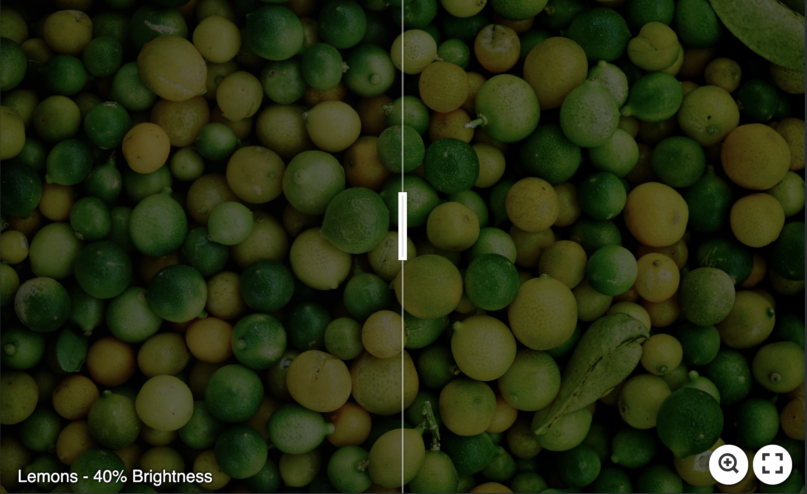
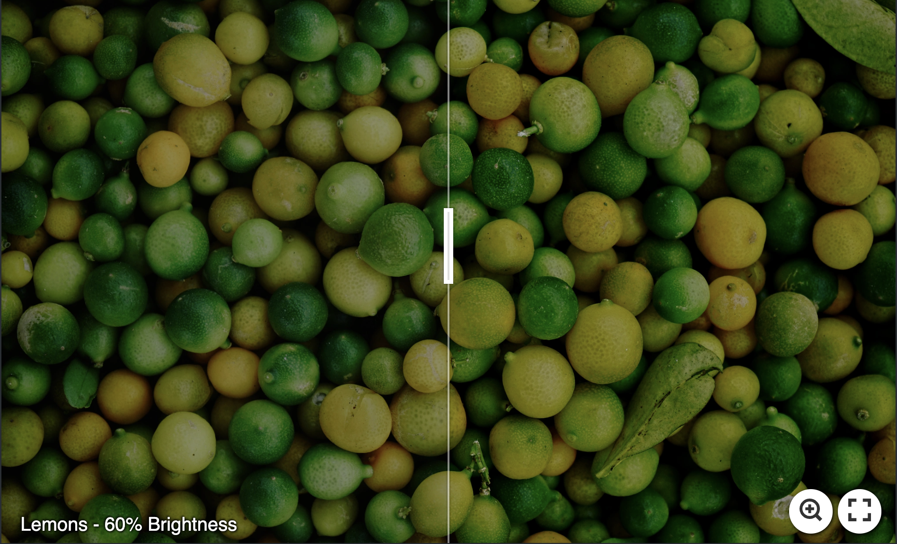
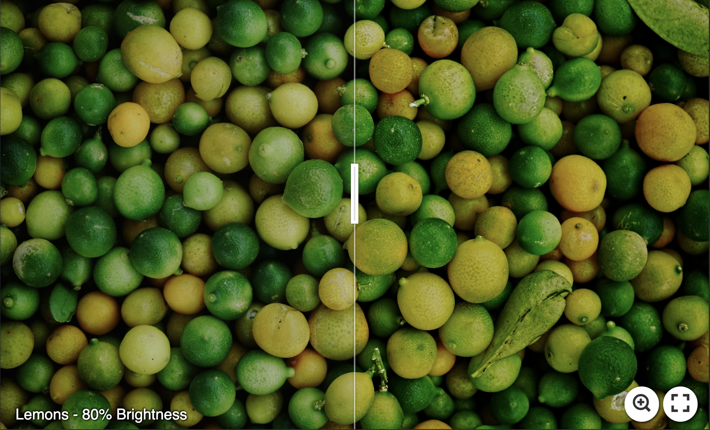
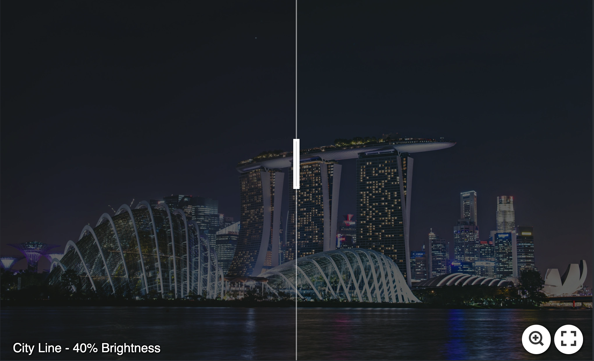
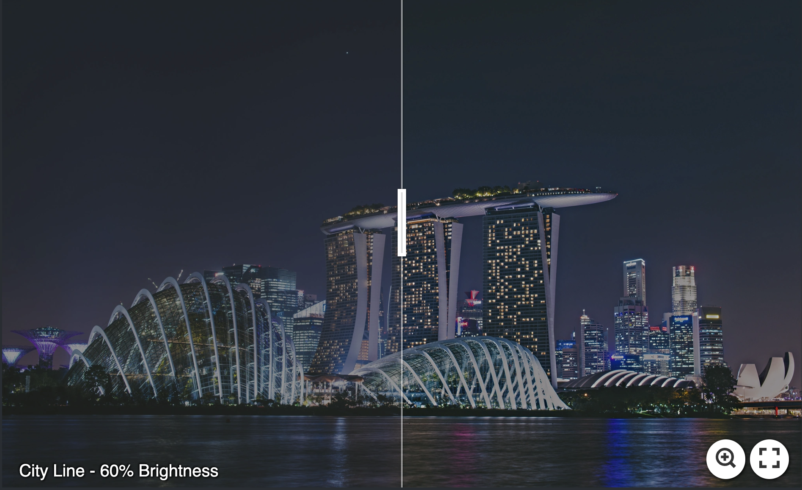
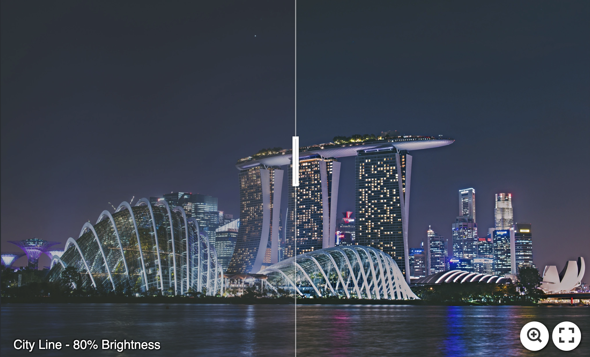
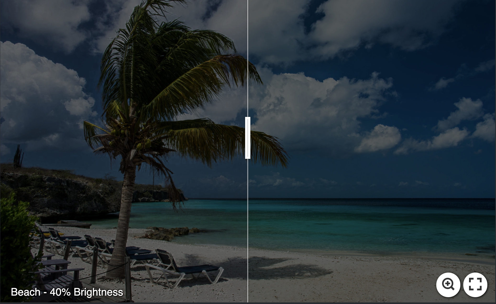
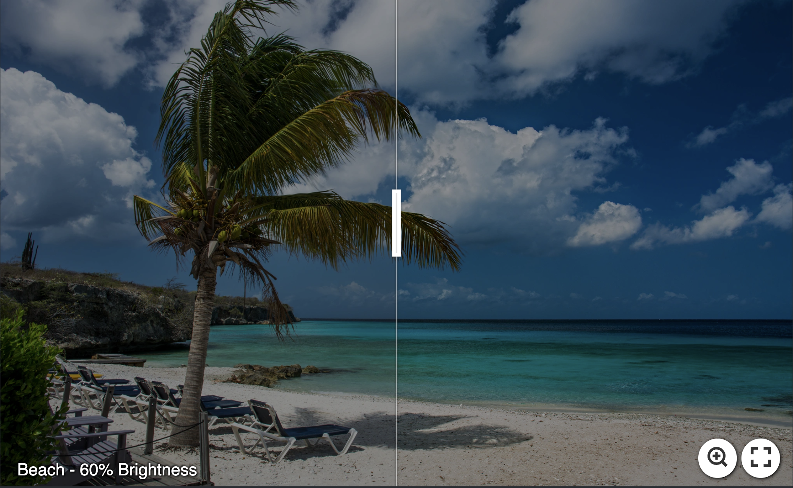
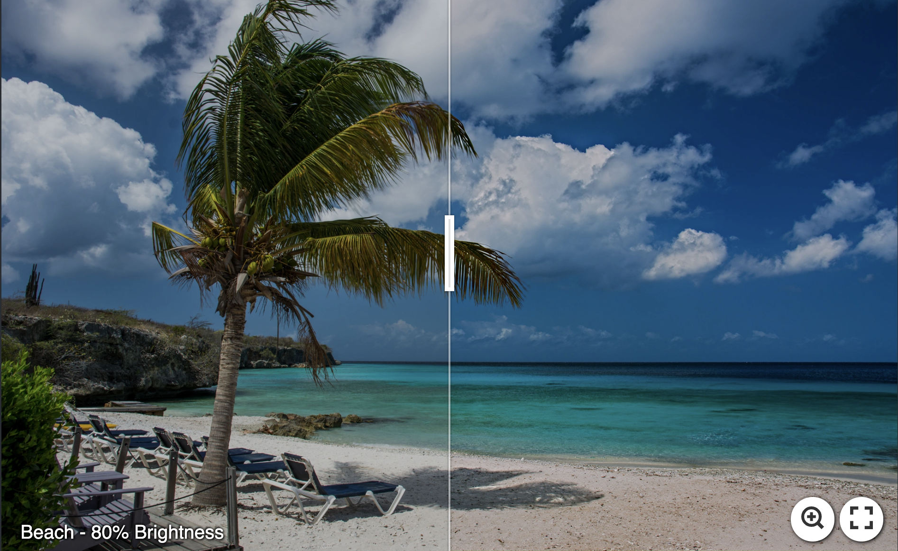

# PerceptDimmed
A Perceptually-Based Deep Learning Approach for Energy-Preserving Image Enhancement

# Output results
Please click on the image to see the image clearly.

## Lemons
### The dimmed input ||| The DCT-based output ||| The Gradient-based output
#### Brightness 40%
  
#### Brightness 60%
  
#### Brightness 80%
  

## City Line
### The dimmed input ||| The DCT-based output ||| The Gradient-based output
#### Brightness 40%
  
#### Brightness 60%
  
#### Brightness 80%
  

## Beach
### The dimmed input ||| The DCT-based output ||| The Gradient-based output
#### Brightness 40%
  
#### Brightness 60%
  
#### Brightness 80%
  
